# Procesverslag
Markdown is een simpele manier om HTML te schrijven.  
Markdown cheat cheet: [Hulp bij het schrijven van Markdown](https://github.com/adam-p/markdown-here/wiki/Markdown-Cheatsheet).

Nb. De standaardstructuur en de spartaanse opmaak van de README.md zijn helemaal prima. Het gaat om de inhoud van je procesverslag. Besteedt de tijd voor pracht en praal aan je website.

Nb. Door *open* toe te voegen aan een *details* element kun je deze standaard open zetten. Fijn om dat steeds voor de relevante stuk(ken) te doen.

## Jij

  
uitwerken voor kick-off werkgroep

  ### Auteur:
  Suzanne Mathijssen

  #### Je startniveau:
  Blauw

  #### Je focus:
  Surface laag
 

## Je website

  
uitwerken voor kick-off werkgroep

  ### Je opdracht:
  Nijntje Museum - https://nijntjemuseum.nl/nl/

  #### Screenshot(s) van de eerste pagina (small screen): 
  Home-pagina
  
  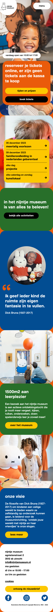

  #### Screenshot(s) van de tweede pagina (small screen):
  Over-pagina

  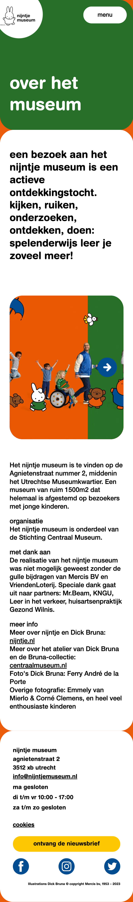
 

## Toegankelijkheidstest 1/2 (week 1)

  
uitwerken na test in 2e werkgroep

  ### Bevindingen
  Lijst met je bevindingen die in de test naar voren kwamen:

  <ul> Content
    <li>"Lees meer" button kan specifieker.</li>
  </ul>
  
  <ul> Global code
    <li>Validation errors zoals "duplicate ID", "bad value", "div not allowed as child of element button", "aria-controls must point to element in the same document, etc".</li>
    <li>Home bevat geen titel.</li>
  </ul>

  <ul> Keyboard
    <li>Focus style is geel of zwart, maar niet duidelijk wanneer welke kleur. Hetzelfde geldt voor de richting waarop de animaties gaan bij het hoveren over de knop.</li>
    <li>Keyboard focus order matched niet helemaal met de visuele lay-out. Navigatie doet hij als laatste.<li>
  </ul>

  <ul> Mobile and touch
    <li>De site kan horizontaal geroteerd worden, maar het is niet ideaal.</li>
  </ul>
  
  <ul> Headings
    <li>H1 op de homepagina is "reserveer je tickets online, er zijn geen tickets aan de kassa te koop". Moet korter en omvangender.</li>
 </ul>
 
  <ul> Lists
    <li>De navigatie en footer bestaan allemaal uit p of button elements i.p.v. lists en listitems.</li>
  </ul>

  <ul> Images
    <li>Naar mijn mening hebben alle belangrijke images een alt attribute en decoratieve images géén alt. Studentassistent vind dat niks decoratie is.</li>
  </ul>

  <ul> Appearance
    <li>Geen dark mode aanwezig (ook niet perse nodig misschien?).</li>
    <li>High contrast mode ook niet supported.</li>
  </ul>
  
  <ul> Animation
    <li>Sommige buttons flitsen te erg/veel.</li>
    <li>Geen reduced motion.</li>
  </ul>

## Breakdownschets (week 1)

  
uitwerken na afloop 3e werkgroep

  ### de hele pagina: 
  
  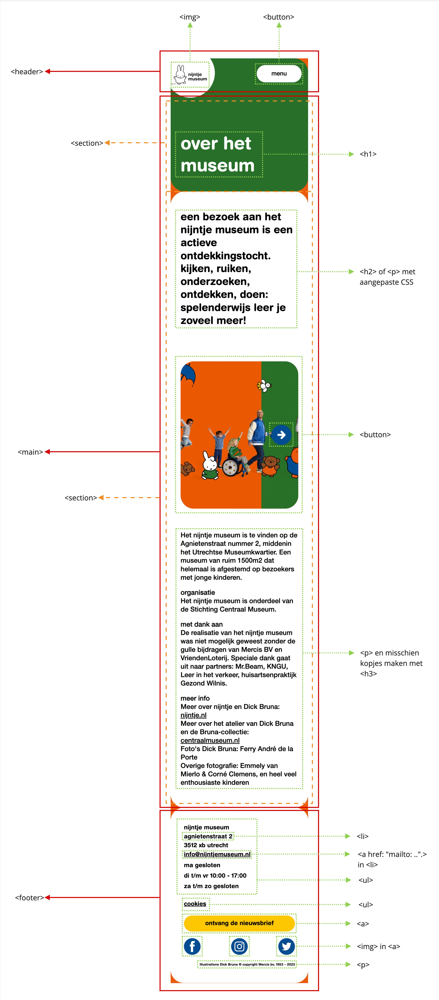

  ### dynamisch deel (bijv menu): 
  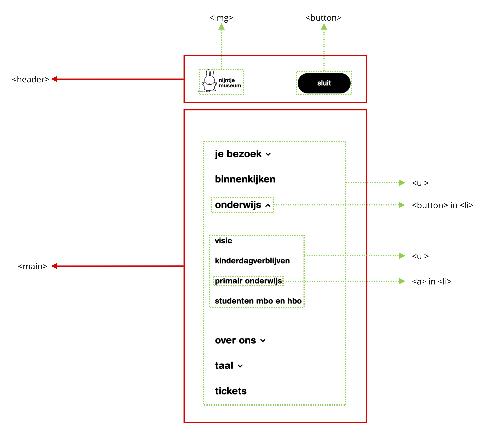

## Voortgang 1 (week 2)

  
uitwerken voor 1e voortgang

  ### Stand van zaken
  Ik heb deze week de basisstructuur van mijn website opgezet d.m.v. HTML te schrijven. Dit ging mij redelijk goed af. Ik vond het fijn om steeds meer een beeld te krijgen van waar de site uit opgebouwd zou worden. Omdat het al best een tijd geleden was dat ik code had geschreven (eerste jaar, blok 2), maakte ik nog wel wat foutjes zoals een paragraph boven een heading schrijven, terwijl ik deze volgorde eigenlijk met CSS moest creëren (p moet namelijk ónder een h), etc.

Home-pagina met HTMl code
  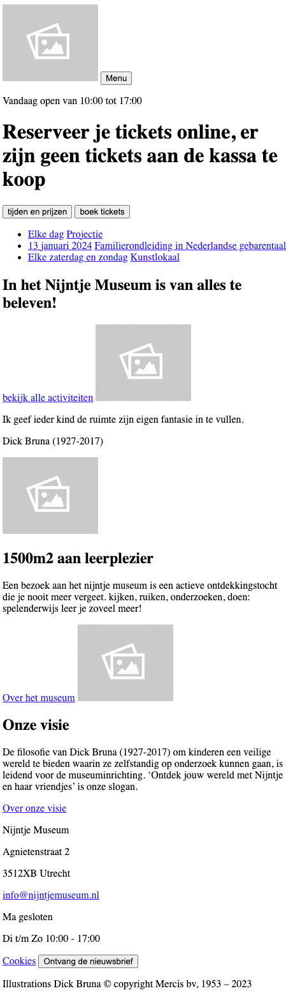
  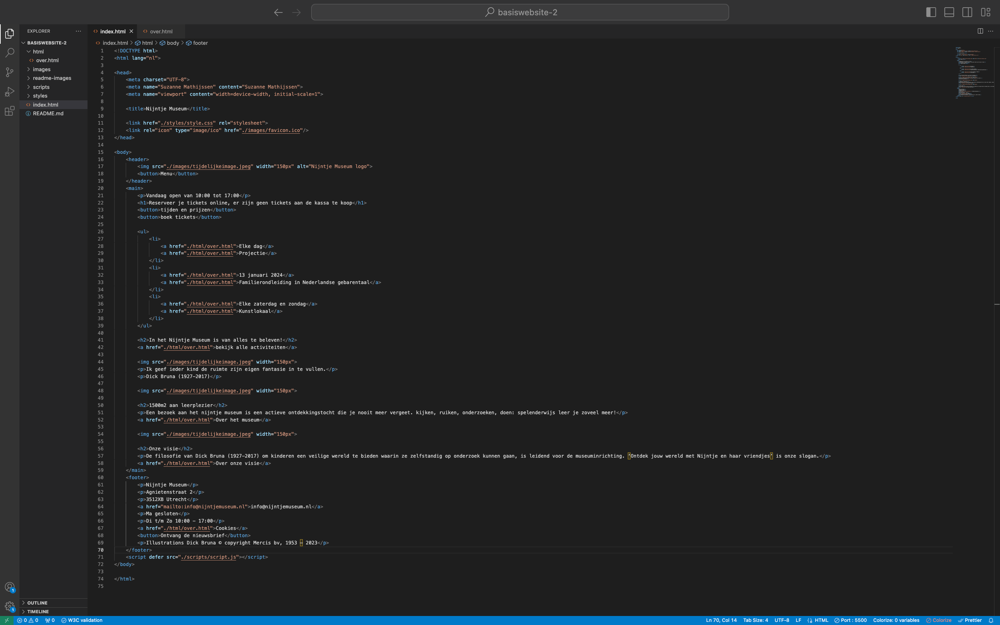

Over-pagina met HTML code
  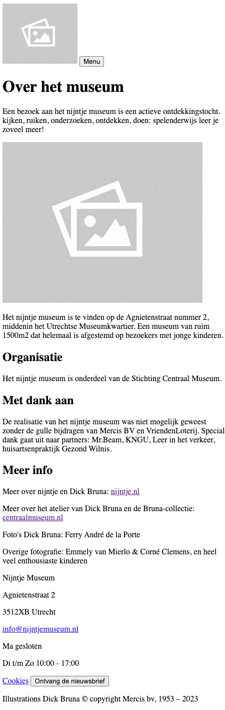
  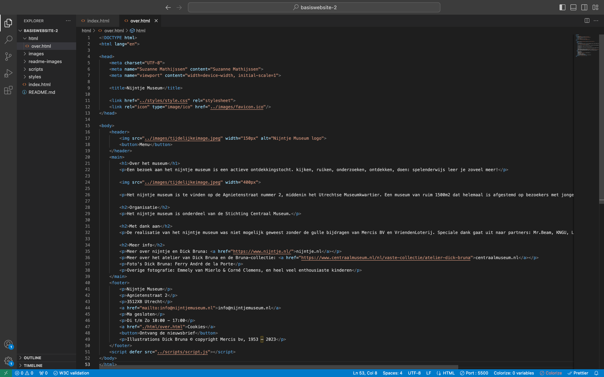

  ### Agenda voor meeting
  samen met je groepje opstellen

  | Filip          | Constant           | Suzanne      |
  | ---            | ---                | ---          |
  | Paddings       | Header sluit niet aan            | Background image  |
  | Intersection observer  | Columns (items onder elkaar)            | Pagina opdelen in blokken      |
  | ...            | ...                | ...          |

  ### Verslag van meeting
  hier na afloop snel de uitkomsten van de meeting vastleggen

  - position: fixed; voor menu knop
  - dvh gebruiken
  - sections aanmaken
  - .visually-hidden

## Voortgang 2 (week 3)

  
uitwerken voor 2e voortgang

  ### Stand van zaken
  Wat goed ging, was het toevoegen van de eerste basis vormgevingselementen d.m.v. CSS. Zo kreeg elke section zijn eigen onderscheidende stijl, waardoor de pagina's steeds meer op de originele begonnen te lijken. Waar ik echter nog wel een beetje mee zat te stoeien was het positioneren van alle content. Ik heb al wel een beginnentje gemaakt, maar als ik het zo zie denk ik dat ik nog wel een lange weg met veel obstakels voor me heb.
  
  Home-pagina met HTML + CSS code
  
  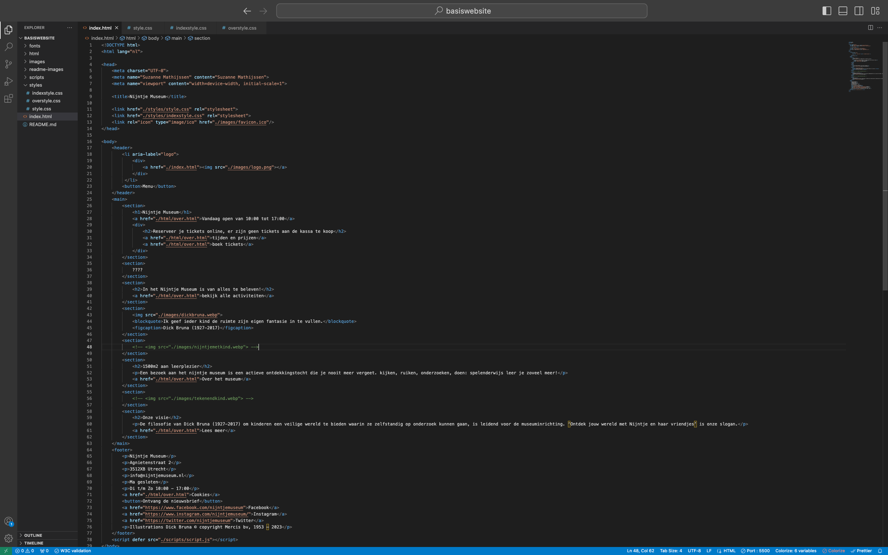
  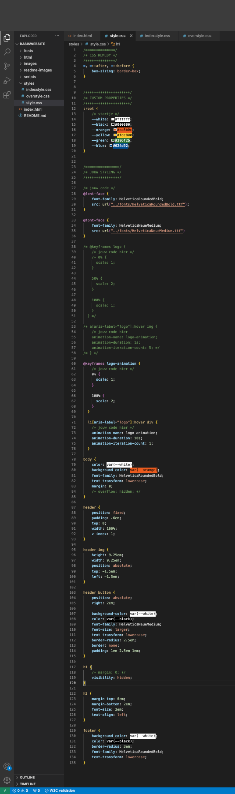
  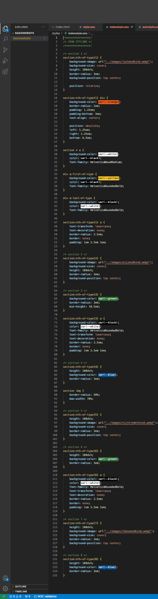

  Over-pagina met HTML + CSS code
  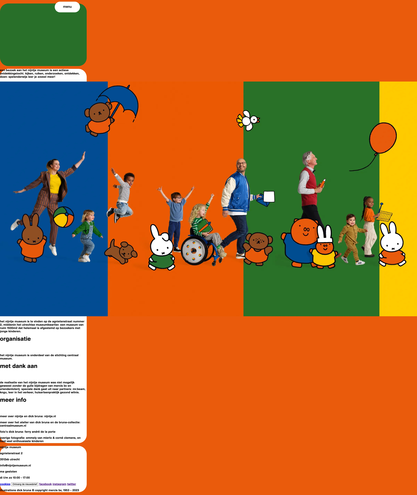
  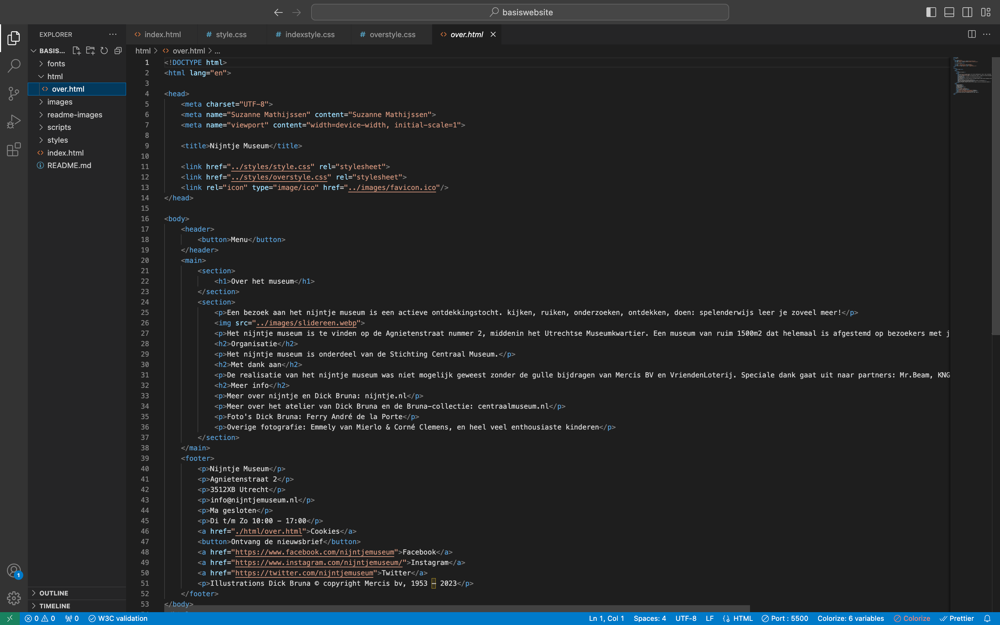
  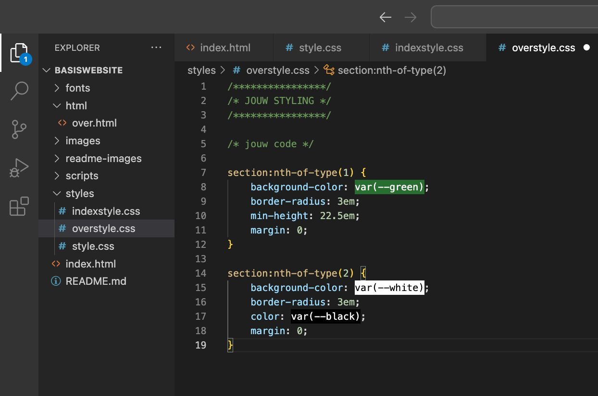

  ### Agenda voor meeting
  samen met je groepje opstellen

  | Filip          | Suzanne            |
  | ---            | ---                |
  | Intersection observer | Header laten verdwijnen |
  | ...            | ...                |

  ### Verslag van meeting
  hier na afloop snel de uitkomsten van de meeting vastleggen

  - ul voor tweede sectie
  - transform pijltjes (tweede sectie)
  - p in footer li in ul maken
  - CSS filenames aanpassen
  - CSS van meer comments voorzien
  - font face alleen in gezamelijke CSS
  - CSS secties specifiekere namen geven
  - colors in Engels
  - laatste px nog naar em veranderen
  - Nadenken welke 5 uit de surface plane lijst
  - div in section veranderen
  - alt tekst toevoegen aan images

## Toegankelijkheidstest 2/2 (week 4)

  
uitwerken na test in 9e werkgroep

  ### Bevindingen
  Lijst met je bevindingen die in de test naar voren kwamen (geef ook aan wat er verbeterd is):

  <ul> Content
    <li>Buttons zijn nu echt allemaal uniek en beschrijvend (voorheen was er nog een button "Lees meer").</li>
  </ul>
  
  <ul> Global code
    <li>Home bevat nu wél een titel. De h1 werd in de originele site niet netjes gebruikt.</li>
  </ul>

  <ul> Keyboard
    <li>Focus style en vormgeving is bij alle buttons nu ongeveer consistent, waar op de originele site nog verwarring was over wanneer de focus style geel of zwart was en wanneer de animatie welke kant op bewoog bij hoveren.</li>
    <li>Ook heb ik ervoor gezorgd dat bij het hoveren de letters in de button ten alle tijden leesbaar blijven. Dat is op de originele site nog niet het geval namelijk.</li>
  </ul>

  <ul> Headings
    <li>H1 op de homepagina is (zoals hierboven ook al even kort benoemd) nu korter en omvangender. Op de originele site was het in eerste instantie "reserveer je tickets online, er zijn geen tickets aan de kassa te koop".</li>
 </ul>
 
  <ul> Lists
    <li>De navigatie en footer bestaan nu wel allemaal uit lists en listitems i.p.v. p of button elements.</li>
  </ul>

  <ul> Appearance
    <li>Nog steeds geen dark mode aanwezig, maar wordt nog aan gewerkt.</li>
  </ul>
  
  <ul> Animation
    <li>Sommige buttons flitsen nog wel wat hevig.</li>
    <li>Er wordt nog aan een reduced motion mode gewerkt.</li>
  </ul>

``

## Voortgang 3 (week 4)

  
uitwerken voor 3e voortgang

  ### Stand van zaken
  Deze week ben ik druk geweest met het positioneren van de vormgegeven elementen. Elk element kreeg zo zijn juiste plek binnen bijv. zijn section. Ik heb ervoor gekozen om dit te doen met position: relative/absolute en vervolgens top/bottom/left/right values, omdat ik voor de surface laag van de site ging en niet responsive. Het scherm blijft hetzelfde, dus de positie daarmee ook. Plus ik kon gemakkelijker en sneller de gewenste positie toewijzen en aanpassen. Verder ben ik details gaan toevoegen die ook erg kenmerkend zijn voor de Nijntje site. Hierbij waren er nog wel een aantal punten waar ik tegen aan liep. Voorbeelden hiervan zijn het uit beeld verdwijnen van de animatie op het logo in de header, het opbouwen van de agenda op de home-page, etc.

 Home-pagina met HTML + CSS code
  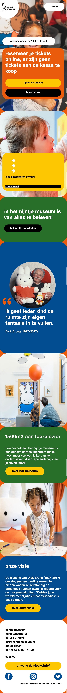
  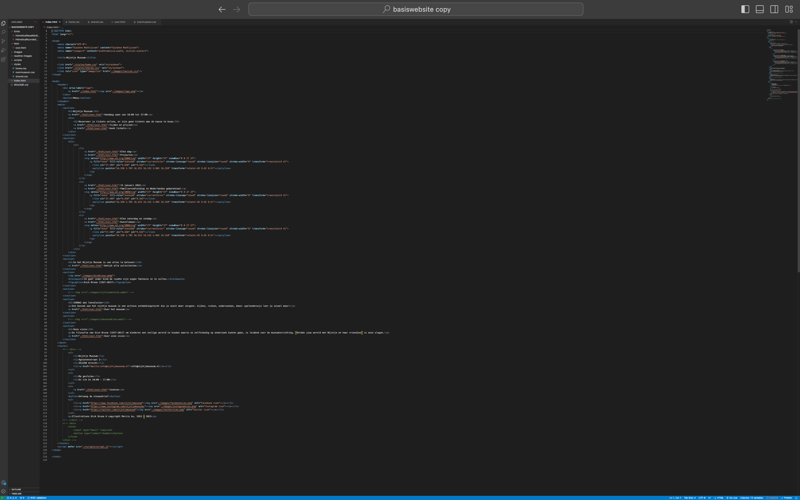
  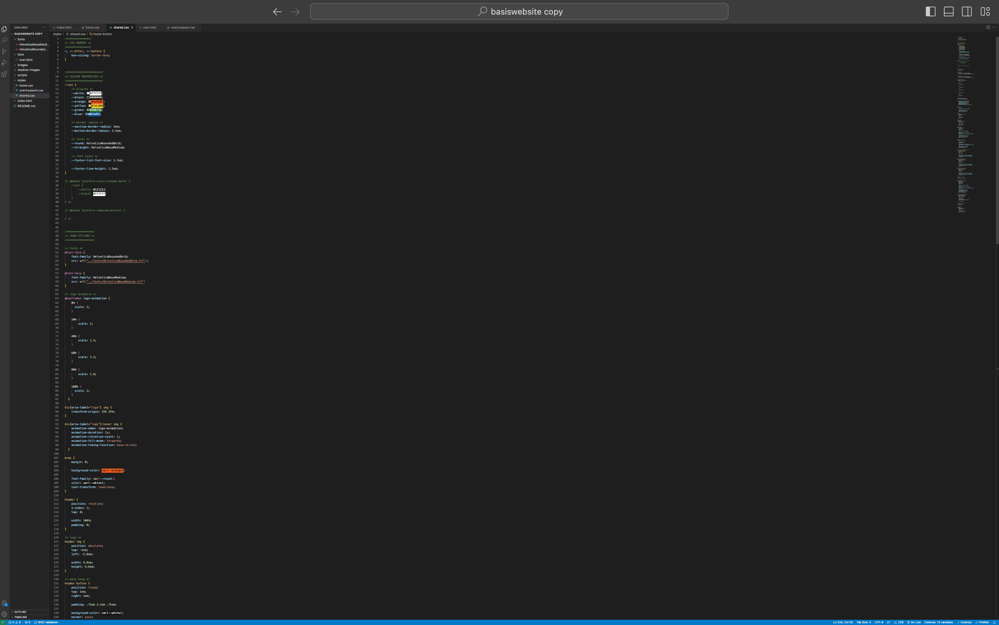
  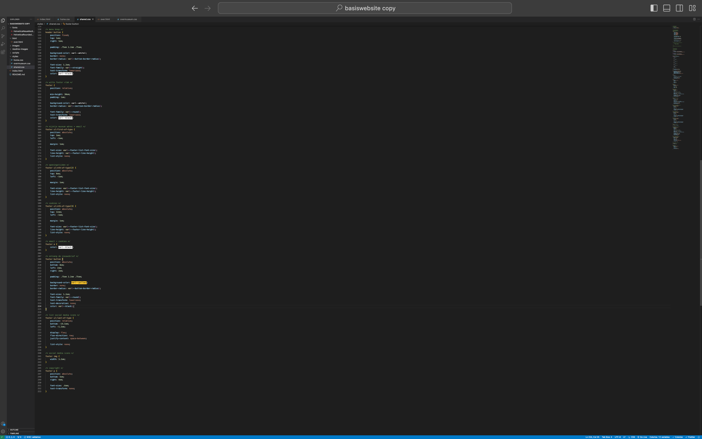
  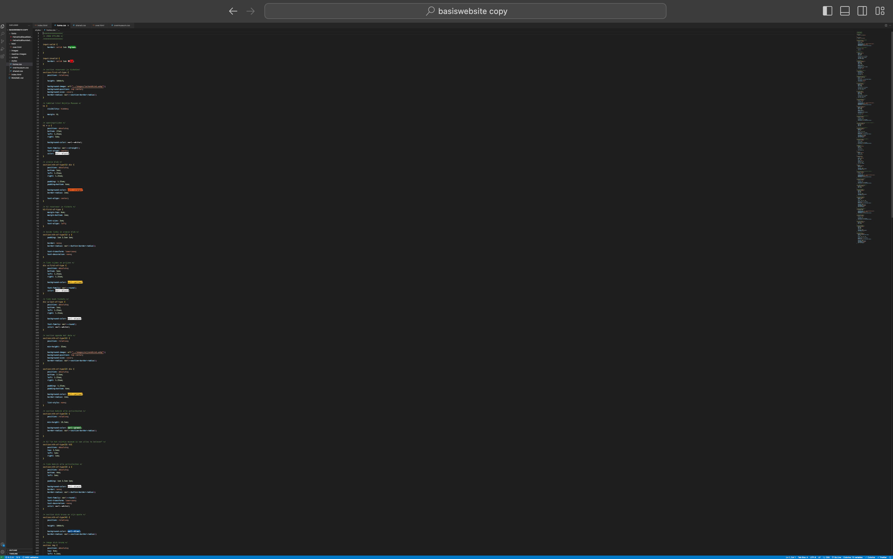
  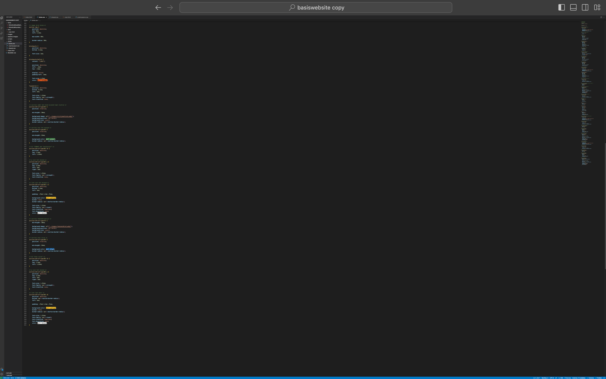

  Over-pagina met HTML + CSS code
  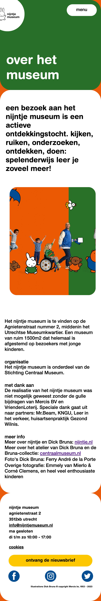
  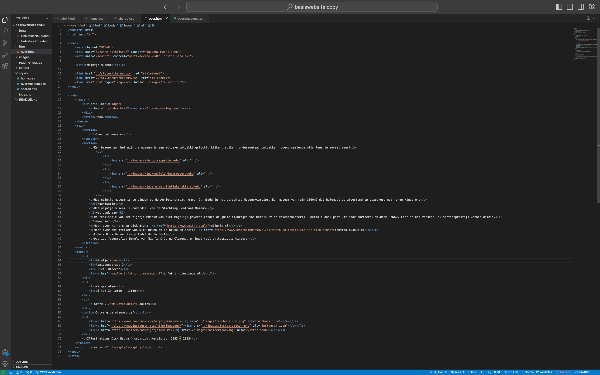
  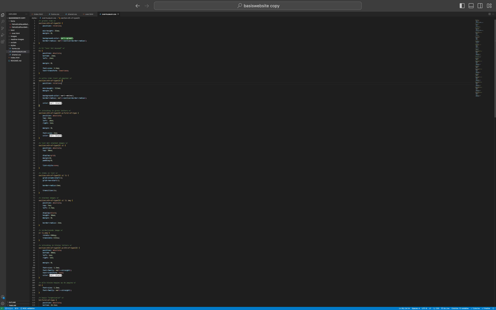
  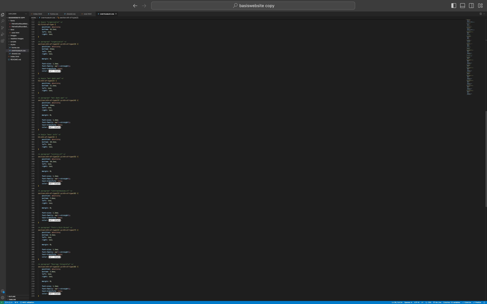

  ### Agenda voor meeting
  samen met je groepje opstellen

  | Filip          | Constant           | Suzanne      | student 4        |
  | ---            | ---                | ---          | ---              |
  | Tekstwolkje CSS | Screenreader verbeteren | Animatie valt buiten beeld |     |
  | Pop-up wolkje  |                    | Skill animation link |          |
  | ...            | ...                | ...          | ...              |

  ### Verslag van meeting
  hier na afloop snel de uitkomsten van de meeting vastleggen

  - Animatie: transform-origin.
  - Animaties op buttons -> zie codePen.

## Eindgesprek (week 5)

  
uitwerken voor eindgesprek

  ### Je uitkomst - karakteristiek screenshots:
  Note: in de laatste week heeft Nijntje Museum veel aanpassingen gedaan aan de site (waaronder nieuwe foto's, andere kleuren, weg van twitter, etc.). Ik heb geprobeerd in de korte hoeveelheid tijd, ook zoveel mogelijk aanpassingen in mijn site door te voeren.

  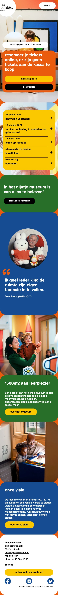
  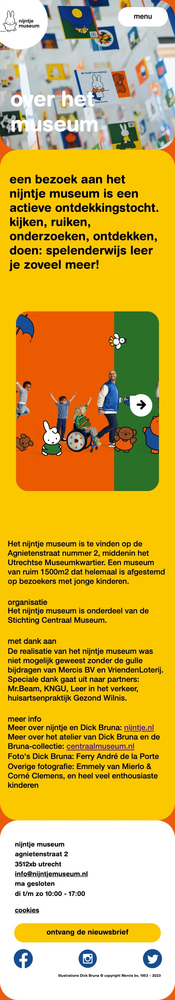

  ### Dit ging goed/Heb ik geleerd: 
  Wat goed ging, was het stellen van prioriteiten tijdens het maken van deze site. Ik merkte dat ik op gegeven moment wat tijd te kort kwam, dus heb ik besloten een lijstje te maken met dingen die écht belangrijk waren en daarmee dus ook écht verwerkt moesten worden. Daarbij ben ik ook wel een klein beetje trots op mezelf en op hoe ik heb doorgezet. Er waren redelijk veel momenten waarop ik helemaal vast liep of gewoon echt geen idee had van hoe ik het moest aanpakken (bijv. menu, aanmeldformulier, reduce motion, etc.), maar als ik maar lang genoeg probeerde (hoe frustrerend het soms ook was) kwam ik er altijd wel ongeveer uit.

  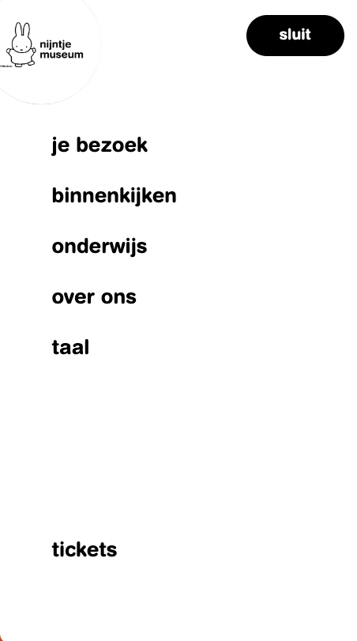
  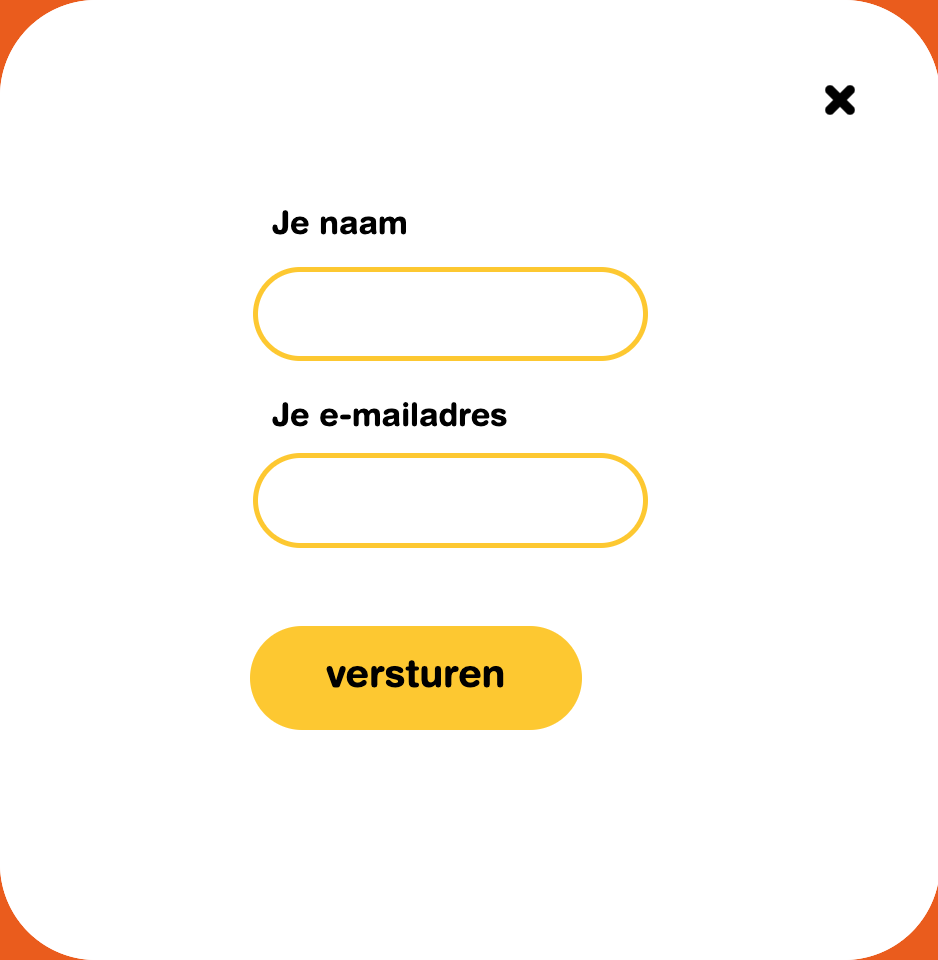

  ### Dit was lastig/Is niet gelukt:
  Wat minder goed ging, was het inschatten van hoe lang ik aan iets zou zitten. Vaak was ik veel langer bezig dan ik verwachtte, ookal ging het maar om een klein dingetje. Zo ook de bovenkant van de pagina. Op de originele site beweegt die namelijk mee tijdens het scrollen, totdat een nieuwe "section" is bereikt. Ik dacht dat ik dit met een fixed border-top o.i.d. wel voor elkaar kon krijgen, maar dit bleek toch wat ingewikkelder dan gedacht. Uiteindelijk heb ik geen tijd meer gehad om dit op te kunnen lossen. Dit probleem had ik met meerdere kleine dingetjes die ik onderweg tegen kwam.

  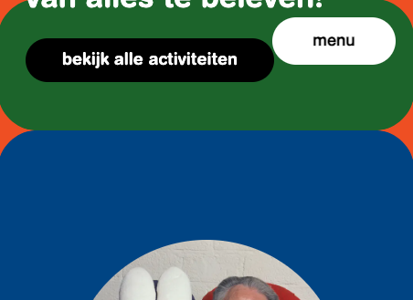
  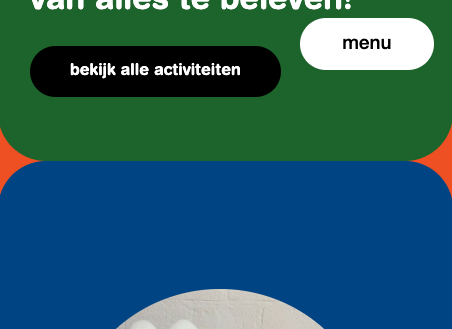

## Bronnenlijst

  
continu bijhouden terwijl je werkt

  Nb. Wees specifiek ('css-tricks' als bron is bijv. niet specifiek genoeg). 
  Nb. ChatGpT en andere AI horen er ook bij.
  Nb. Vermeld de bronnen ook in je code.

  1. css - tricks https://css-tricks.com/dark-modes-with-css/
  2. mdn web docs - https://developer.mozilla.org/en-US/docs/Web/CSS/@media/prefers-reduced-motion
  3. Nijntje Museum - https://nijntjemuseum.nl/nl/
  4. hulp van Sanne (uitleg, animatielessen/-opdrachten, codePens, etc.)
  5. stack overflow - https://stackoverflow.com/questions/2941189/how-to-overlay-one-div-over-another-div
  6. stack overflow - https://stackoverflow.com/questions/43554329/html-css-how-to-put-a-line-between-some-rows-of-tables-but-not-all
  7. study tonight - https://www.studytonight.com/css-howtos/how-to-flip-image-with-css#:~:text=The%20transform%3A%20scalex(%2D1,flipped%20to%20its%20mirror%20image
  8. iconify - https://icon-sets.iconify.design/ic/baseline-facebook/
  9. iconify - https://icon-sets.iconify.design/entypo-social/instagram-with-circle/
  10. iconify - https://icon-sets.iconify.design/formkit/twitter/
  11. c#corner - https://www.c-sharpcorner.com/article/show-and-hide-divs-on-button-click-with-javascript/ 
  12. Quora - https://www.quora.com/How-do-you-prevent-a-page-reload-in-JavaScript#:~:text=To%20prevent%20a%20form%20from,form%20and%20reloading%20the%20page.

